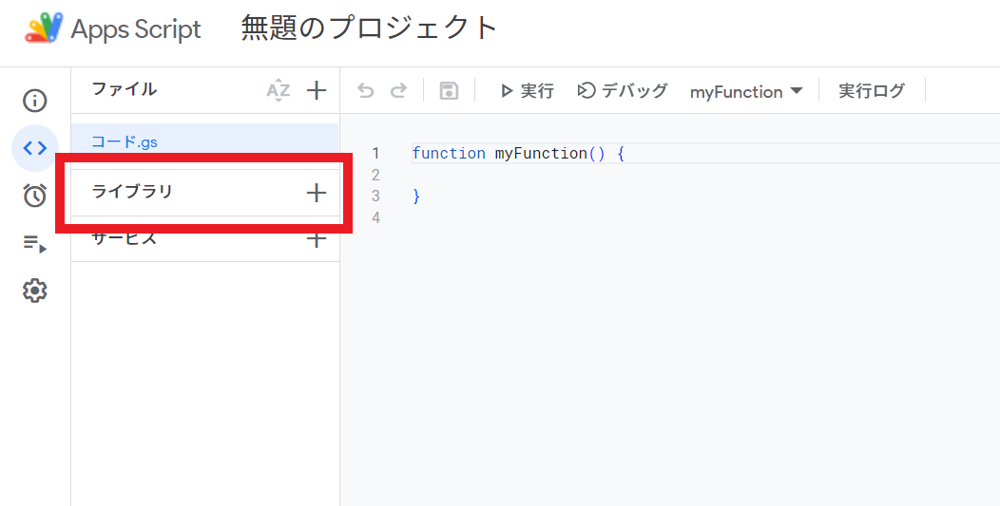

# ChatworkGAS

Google Apps Script のための Chatwork クライアント

## 注意
**このライブラリはChatwork社公式のものではありません**

このライブラリは [@sudame](https://github.com/sudame/) が独自に作成したものであり、ライブラリに関する権利・責務は [@sudame](https://github.com/sudame) 個人に帰します。また、このライブラリを作るにあたり、ソースコードを含め、Chatwork社のいかなる内部情報も利用していません。

## 使い方

### Google Apps Script へのライブラリの追加

次のスクリプト ID を Google Apps Script のエディタ上で追加してください。

```
1KDjPcT6QSGO-urrEPV9BtQyaxAke27Cv_lA3-EhusZTIeGZ3qi0GzOHL
```



### コード例

```js
// ログイン
const chatwork = ChatworkGAS.login("あなたのAPIトークン");

// 例1.
// チャット一覧を取得する
const res1 = chatwork.rooms.get();
const rooms = res1.data;
// チャット一覧のデータを表示する
console.log(rooms);
// チャット一覧取得直後の、APIのレートリミットを表示する
console.log(res1.rateLimit);
// チャット一覧取得時のHTTPステータスを表示する
console.log(res1.statusCode);

// 例2.
// (あるチャット内の)チャットのメッセージ一覧を取得する
const res2 = chatwork.rooms.roomId(1234).messages.get();
const messages = res2.data;
// メッセージ一覧を表示する
console.log(messages);
```

### TypeScript / JavaScript

Google Apps Script は [@google/clasp](https://github.com/google/clasp) を用いることで、TypeScript を用いた開発ができます。

このライブラリを clasp を介して用いる場合、型情報を利用することができます。

#### インストール

```
npm i @sudame/chatwork-gas
```

#### 利用

インポート時に `as` 句を用いて、 Google Apps Scirpt のエディタ上でライブラリを追加する際に自身で指定した名前空間配下にインポートされるようにしてください。

```ts
import * as ChatworkGAS from "@sudame/chatwork-gas";

const chatwork = ChatworkGAS.login("あなたのAPIトークン");
// ...
```

NG 例：

次のように `login` だけをインポートすることも TypeScript 上は可能ですが、 Google Apps Script 上では `login` 関数は `ChatworkGAS` (または自身が指定した名前) 名前空間の配下に配置されるため、実行できません。

```ts
import { login } from "@sudame/chatwork-gas";

const chatwork = login("あなたのAPIトークン");
```

#### 注意

npm モジュールとしてインストールされるのは型情報のみです。 `@sudame/chatwork-gas` は名前の通り Google Apps Script に強く依存していますので、ローカルマシン上で実行することはできません。

## API

ライブラリは https://developer.chatwork.com/reference/ に準拠するように設計されています。

例えば「チャットのメッセージを未読にする」エンドポイントである

`PUT /rooms/{room_id}/messages/unread`

を実行したい場合、次のようなプログラムで実行できます。

```ts
// ログイン
const chatwork = login("あなたのAPIトークン");

// 実行
const params = { message_id: 101 };
chatwork.rooms.roomId(1234).messages.unread.put(params);
```

## 実装状況

- [x] `GET /me`
- [x] `GET /my/status`
- [x] `GET /my/tasks`
- [ ] `GET /contacts`
- [x] `GET /rooms`
- [ ] `POST /rooms`
- [x] `GET /rooms/{room_id}`
- [ ] `PUT /rooms/{room_id}`
- [ ] `DELETE /rooms/{room_id}`
- [ ] `GET /rooms/{room_id}/members`
- [ ] `PUT /rooms/{room_id}/members`
- [x] `GET /rooms/{room_id}/messages`
- [x] `POST /rooms/{room_id}/messages`
- [ ] `PUT /rooms/{room_id}/messages/read`
- [ ] `PUT /rooms/{room_id}/messages/unread`
- [ ] `GET /rooms/{room_id}/messages/{message_id}`
- [ ] `PUT /rooms/{room_id}/messages/{message_id}`
- [ ] `DELETE /rooms/{room_id}/messages/{message_id}`
- [x] `GET /rooms/{room_id}/tasks`
- [ ] `POST /rooms/{room_id}/tasks`
- [ ] `GET /rooms/{room_id}/tasks/{task_id}`
- [ ] `PUT /rooms/{room_id}/tasks/{task_id}/status`
- [ ] `GET /rooms/{room_id}/files`
- [ ] `POST /rooms/{room_id}/files`
- [ ] `GET /rooms/{room_id}/files/{file_id}`
- [ ] `GET /rooms/{room_id}/link`
- [ ] `PUT /rooms/{room_id}/link`
- [ ] `POST /rooms/{room_id}/link`
- [ ] `DELETE /rooms/{room_id}/link`
- [ ] `GET /incoming_requests`
- [ ] `PUT /incoming_requests/{request_id}`
- [ ] `DELETE /incoming_requests/{request_id}`
